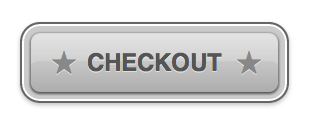

# CSS

Questions from https://github.com/developerquestions/css-questions
- What are the pros and cons of using absolute positioning?
- What is the difference between display: inline; and display: inline-block;?

Questions from https://github.com/bargitta/cssInterview
- What is the box model? Draw it out and explain the different elements.
- Where to define styles?
- List CSS selectors and their priorities
- The difference between block element, inline-block element and inline element
- Talk about position property, and its values
- How to hide an element?
- What is float element?
- What is pseudo element? what is pseudo class?
- How to center align a paragraph?
- How to center align a div inside another div?
- How to make a two column Web page? a three column Web page?
- How to draw a triangle? a circle? a colored square?
- How to make a tab view?

Questions from https://css-tricks.com/interview-questions-css/
- Using CSS properties alone, recreate this button:


- Describe what a “reset” CSS file does and how it’s useful. Are you familiar with normalize.css? Do you understand how they differ?
- What are the various techniques for clearing floats?
- What are sprites and why would use them? How do you go about creating them? What are possible alternatives to sprites?
- What are some accessibility concerns that come up in CSS?
- What tools do you use for cross-browser testing?
- Say you found a rendering problem on one of your sites in Internet Explorer 8, which you have decided you are supporting. How would you approach fixing it?
- What is responsive design all about?
- Have you ever worked with a grid layout? What are your thoughts on that?
- What are the benefits of SVG?
- Say you were tasked with coding a design that used non-standard web fonts, how would you go about it?
- Explain to me what's going on in this CSS selector:
```css
[role=navigation] > ul a:not([href^=mailto]) {

}
```

Questions from http://www.skilledup.com/articles/25-css-interview-questions-answers
- Explain what a class selector is and how it’s used
- What are pseudo classes and what are they used for?
- Explain the three main ways to apply CSS styles to a Web page
- What is grouping and what is it used for?
- What is an ID selector and how is it used?
- What is a Class selector and how does it differ from an ID selector?
- What are child selectors?
- What are the different CSS properties used to change dimensions and what values can they accept?
- How is the float property implemented in CSS?
- How to restore the default property value using CSS?
- What is the purpose of pseudo-elements and how are  they made?
- What is the purpose of the z-index and how is it used?
- What are the advantages and disadvantages of External Style Sheets?
- Explain the difference between visibility:hidden and display:none
- What are some of the new features and properties in CSS3?
- Why shouldn’t I use fixed sized fonts?
- Which font names are available on all platforms?
- What are the advantages/disadvantages of using CSS preprocessors? (SASS, Compass, Stylus, LESS)
- Why and how are shorthand properties used? Give examples.

# [Back to readme](../readme.md)
