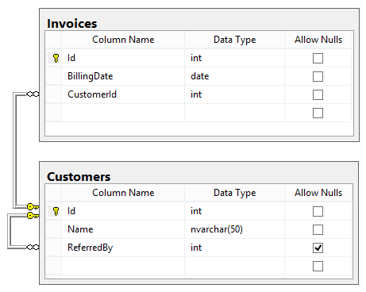

# SQL

Questions from http://www.toptal.com/sql/interview-questions

- What does `UNION` do? What is the difference between `UNION` and `UNION ALL`?
- List and explain the different types of `JOIN` clauses supported in ANSI-standard SQL.
- Consider the following two query results:
```
SELECT count(*) AS total FROM orders;

+-------+
| total |
+-------+
|  100  |
+-------+

SELECT count(*) AS cust_123_total FROM orders WHERE customer_id = '123';

+----------------+
| cust_123_total |
+----------------+
|       15       |
+----------------+
```
Given the above query results, what will be the result of the query below?
```
SELECT count(*) AS cust_not_123_total FROM orders WHERE customer_id <> '123'
```

-  What will be the result of the query below? Explain your answer and provide a version that behaves correctly.
```
select case when null = null then 'Yup' else 'Nope' end as Result;
```

- Given the following tables:
```
sql> SELECT * FROM runners;
+----+--------------+
| id | name         |
+----+--------------+
|  1 | John Doe     |
|  2 | Jane Doe     |
|  3 | Alice Jones  |
|  4 | Bobby Louis  |
|  5 | Lisa Romero  |
+----+--------------+

sql> SELECT * FROM races;
+----+----------------+-----------+
| id | event          | winner_id |
+----+----------------+-----------+
|  1 | 100 meter dash |  2        |
|  2 | 500 meter dash |  3        |
|  3 | cross-country  |  2        |
|  4 | triathalon     |  NULL     |
+----+----------------+-----------+
```
What will be the result of the query below?
```
SELECT * FROM runners WHERE id NOT IN (SELECT winner_id FROM races)
```
Explain your answer and also provide an alternative version of this query that will avoid the issue that it exposes.

- Given two tables created and populated as follows:
```
CREATE TABLE dbo.envelope(id int, user_id int);
CREATE TABLE dbo.docs(idnum int, pageseq int, doctext varchar(100));

INSERT INTO dbo.envelope VALUES
  (1,1),
  (2,2),
  (3,3);

INSERT INTO dbo.docs(idnum,pageseq) VALUES
  (1,5),
  (2,6),
  (null,0);
```
What will the result be from the following query:
```
UPDATE docs SET doctext=pageseq FROM docs INNER JOIN envelope ON envelope.id=docs.idnum
WHERE EXISTS (
  SELECT 1 FROM dbo.docs
  WHERE id=envelope.id
);
```

- What is wrong with this SQL query? Correct it so it executes properly.
```
SELECT Id, YEAR(BillingDate) AS BillingYear 
FROM Invoices
WHERE BillingYear >= 2010;
```

- Given these contents of the Customers table:
```
Id	Name			ReferredBy
1	John Doe		NULL
2	Jane Smith		NULL
3	Anne Jenkins		2
4	Eric Branford		NULL
5	Pat Richards		1
6	Alice Barnes		2
```
Here is a query written to return the list of customers not referred by Jane Smith:
```
SELECT Name FROM Customers WHERE ReferredBy <> 2;
```
What will be the result of the query? Why? What would be a better way to write it?

- Considering the database schema displayed in the SQLServer-style diagram below, write a SQL query to return a list of all the invoices. For each invoice, show the Invoice ID, the billing date, the customer’s name, and the name of the customer who referred that customer (if any). The list should be ordered by billing date.


- Assume a schema of `Emp ( Id, Name, DeptId ) , Dept ( Id, Name).`

If there are 10 records in the Emp table and 5 records in the Dept table, how many rows will be displayed in the result of the following SQL query: `Select * From Emp, Dept`

- Given a table SALARIES, such as the one below, that has `m = male` and `f = female` values. Swap all `f` and `m` values (i.e., change all `f` values to `m` and vice versa) with a single update query and no intermediate temp table.
```
Id  Name  Sex  Salary
1   A     m    2500
2   B     f    1500
3   C     m    5500
4   D     f    500
```

- Given two tables created as follows
```
create table test_a(id numeric);

create table test_b(id numeric);

insert into test_a(id) values
  (10),
  (20),
  (30),
  (40),
  (50);

insert into test_b(id) values
  (10),
  (30),
  (50);
```
Write a query to fetch values in table `test_a` that are and not in `test_b` **without** using the NOT keyword.

- Given a table `TBL` with a field `Nmbr` that has rows with the following values:
```
1, 0, 0, 1, 1, 1, 1, 0, 0, 1, 0, 1, 0, 1, 0, 1
```
Write a query to add 2 where `Nmbr` is 0 and add 3 where `Nmbr` is 1.

- Write a SQL query to find the 10th highest employee salary from an `Employee` table. Explain your answer. (Note: You may assume that there are at least 10 records in the `Employee` table.)
- Write a SQL query using `UNION ALL` (not `UNION`) that uses the `WHERE` clause to eliminate duplicates. Why might you want to do this?
- Given the following tables:
```
SELECT * FROM users;

user_id  username
1        John Doe                                                                                            
2        Jane Don                                                                                            
3        Alice Jones                                                                                         
4        Lisa Romero

SELECT * FROM training_details;

user_training_id  user_id  training_id  training_date
1                 1        1            "2015-08-02"
2                 2        1            "2015-08-03"
3                 3        2            "2015-08-02"
4                 4        2            "2015-08-04"
5                 2        2            "2015-08-03"
6                 1        1            "2015-08-02"
7                 3        2            "2015-08-04"
8                 4        3            "2015-08-03"
9                 1        4            "2015-08-03"
10                3        1            "2015-08-02"
11                4        2            "2015-08-04"
12                3        2            "2015-08-02"
13                1        1            "2015-08-02"
14                4        3            "2015-08-03"
```
Write a query to to get the list of users who took the a training lesson more than once in the same day, grouped by user and training lesson, each ordered from the most recent lesson date to oldest date.

- What is an execution plan? When would you use it? How would you view the execution plan?
- What is a key difference between Truncate and Delete?

Questions taken from http://dwbi.org/database/sql/72-top-20-sql-interview-questions-with-answers

# [Back to readme](../readme.md)